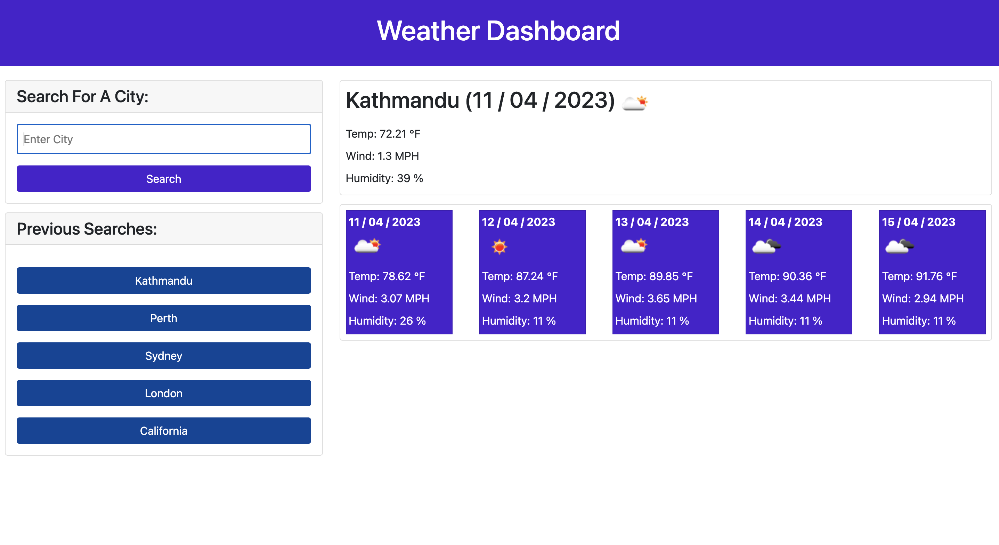
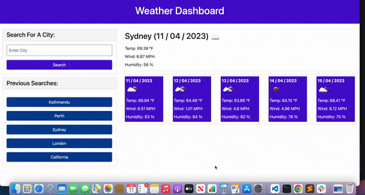

# 06 Server-Side APIs: 5-day-weatherforcast

This app presents current weather as well as 5 day future weather forcast for a particular city. This app uses [5 Day Weather Forecast](https://openweathermap.org/forecast5) to retrieve weather data for cities.

## User Story

```
AS A traveler
I WANT to see the weather outlook for multiple cities
SO THAT I can plan a trip accordingly
```

## Acceptance Criteria

```
GIVEN a weather dashboard with form inputs
WHEN I search for a city
THEN I am presented with current and future conditions for that city and that city is added to the search history
WHEN I view current weather conditions for that city
THEN I am presented with the city name, the date, an icon representation of weather conditions, the temperature, the humidity, and the wind speed
WHEN I view future weather conditions for that city
THEN I am presented with a 5-day forecast that displays the date, an icon representation of weather conditions, the temperature, the wind speed, and the humidity
WHEN I click on a city in the search history
THEN I am again presented with current and future conditions for that city
```

## Mock-Up

The following images show the web application's appearance and functionality:



The following video demonstrates the application functionality:



## Github Deployment

The following link redirects to the deployed application:

[Github Deployment Link](https://sadimamaharjan.github.io/5-day-weatherforcast/)
